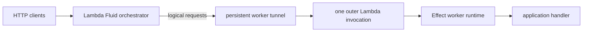

# System architecture

## Core idea

Default Lambda admits one AWS invocation into an execution environment at a
time. If that invocation awaits database or network I/O, its JavaScript thread
has no second AWS invocation to execute.

Lambda Fluid changes the unit of work visible inside the environment:



AWS still sees one invocation. The worker sees multiple logical requests and
runs each as its own supervised Effect fiber. When request A awaits I/O, request
B can execute on the same Node.js event loop.

## Responsibility boundaries

| Component       | Owns                                                                                    |
| --------------- | --------------------------------------------------------------------------------------- |
| Client boundary | HTTP method, path, headers, body, and streamed response                                 |
| Orchestrator    | Worker directory, health evidence, reservations, routing, correlation, launch decisions |
| Worker          | Final admission, request fibers, cancellation, handler execution, response frames       |
| Protocol        | Typed identities, lifecycle messages, schemas, serialization, framing                   |
| Tunnel          | Socket-to-Channel composition and bidirectional backpressure                            |
| AWS adapter     | Lambda entrypoint, outer invocation, credentials, invocation deadline                   |
| Example         | Application handler plus the benchmark request plan                                     |

The orchestrator never interprets application-specific handler data. It
translates public HTTP into an internal `JobRequest`, routes it, and translates
response frames back to public HTTP.

## One application pool

This repository is intended to be dropped into one application's
infrastructure. It does not multiplex unrelated tenant code.

```text
one orchestrator
  -> one application revision
  -> one compatible worker pool
  -> many end-user requests
```

That is why the active protocol has no `deploymentId`. Revision-aware rolling
deployments are a future concern and should use an explicit worker revision,
not an accidental multi-tenant abstraction.

## Effect's role

- `TxRef` makes fleet selection plus reservation atomic.
- `FiberMap` supervises active jobs by request identity.
- `FiberSet` supervises outer Lambda invocations.
- bounded `Queue` provides worker response backpressure.
- `Stream` and `Channel` compose request/response flow over sockets.
- `Scope` owns servers, tunnels, worker fibers, and cleanup.
- Schema decodes wire data into domain values.

Execution modes swap infrastructure layers and adapters; the protocol,
orchestrator control plane, and worker runtime remain shared.
