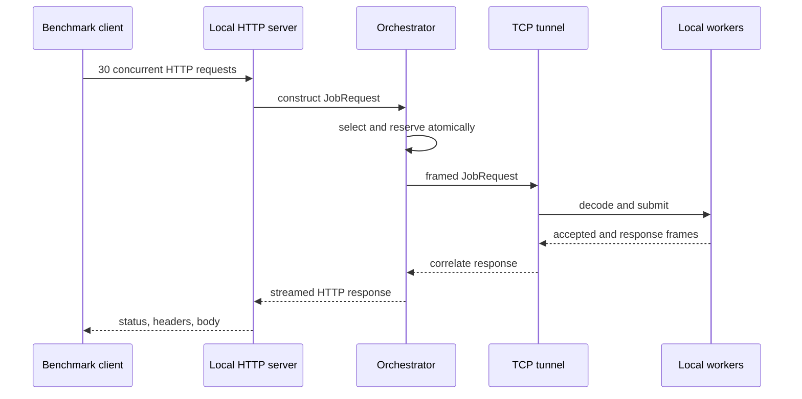

# Mode 1: local end to end

Mode 1 is the primary judge path. It requires no cloud account and exercises the
project architecture rather than calling the example handler directly.

## Finite commands

Single endpoint, 30 concurrent order requests:

```bash
pnpm bench examples/01-order.ts
```

Three endpoints, 30 concurrent mixed requests:

```bash
pnpm bench examples/02-three-endpoints.ts
```

Each example provides:

```text
handler   ordinary application code executed by workers
requests  HTTP-shaped load generated by the benchmark client
```



## What this proves

- application-agnostic handler execution;
- one and three endpoint routing;
- fragmented and coalesced TCP frame decoding;
- concurrent logical requests inside workers;
- atomic multi-worker selection and reservation;
- Pack/Spread policy changes;
- streamed response reconstruction at the HTTP boundary;
- finite scoped startup and shutdown.

## Interactive server

```bash
pnpm local
```

| Service                | Default address         |
| ---------------------- | ----------------------- |
| Application HTTP       | `http://127.0.0.1:3000` |
| Worker TCP tunnel      | `127.0.0.1:9000`        |
| Fake inventory service | `http://127.0.0.1:3001` |

```bash
curl -N http://127.0.0.1:3000/orders \
  -H 'content-type: application/json' \
  --data '{"firstCpuMs":5,"ioDelayMs":200,"secondCpuMs":5,"responseChunks":3,"delayBetweenChunksMs":10}'
```

Configuration can override `HTTP_PORT`, `TUNNEL_PORT`, `INVENTORY_PORT`, and
`INITIAL_ADMISSION_LIMIT`.

## Source entrypoints

- finite composition: `packages/benchmark-cli/src/cli.ts`
- adaptive capacity: `packages/orchestrator/src/adaptive-capacity.ts`
- HTTP translation: `packages/orchestrator/src/http.ts`
- worker runtime: `packages/worker/src/runtime.ts`
- interactive composition: `src/main.ts`
