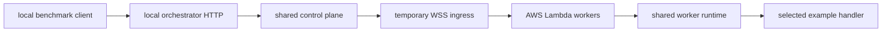

# Mode 2: local orchestrator to AWS Lambda

Mode 2 keeps the client and orchestrator local while running workers inside real
AWS Lambda execution environments.



## Prerequisites

1. AWS permissions for Lambda, IAM roles, and CloudWatch Logs.
2. An Alchemy profile containing AWS credentials.
3. `cloudflared` on `PATH`, or `CLOUDFLARED_BIN` pointing to it.
4. AWS budget alerts. This mode can incur charges.

```bash
pnpm infra:login --profile builder
pnpm infra:profile --profile builder
pnpm infra:plan --profile builder
```

## Run

```bash
pnpm demo:local-aws examples/01-order.ts --profile builder
pnpm demo:local-aws examples/02-three-endpoints.ts --profile builder
```

The command:

1. builds the local composition;
2. generates an ignored Lambda entrypoint importing the selected example;
3. deploys or updates `lambda-fluid-worker` through Alchemy;
4. starts local worker WebSocket ingress;
5. starts a scoped Quick Tunnel with a random path token;
6. launches enough outer invocations for the known batch;
7. waits for worker registration;
8. sends 30 concurrent HTTP requests and prints the report;
9. closes the temporary tunnel and invocation fibers.

The Lambda resource remains deployed. Remove it with:

```bash
pnpm infra:destroy --profile builder --yes
```

Inspect the plan before destroying resources managed by the same stack/stage.

## Build-time example split

Executable TypeScript is never sent through the tunnel:

```text
handler  -> generated entrypoint -> bundled into Lambda
requests -> local benchmark driver
```

Only typed data frames cross the connection.

## Invocation adapter

The launcher depends on the project-owned `WorkerInvoker` service. This mode
provides `DirectAwsWorkerInvokerLive` because a laptop is not an Alchemy binding
host. Distilled AWS imports are confined to that adapter.

An Alchemy-managed AWS orchestrator could provide the same capability with
`AWS.Lambda.InvokeFunction(target)` and receive generated IAM permissions,
without changing launcher control flow.

## Topology warning

The Quick Tunnel creates a geographic hairpin between the laptop, Cloudflare,
and AWS. It is convenient development ingress, not a production latency
topology. Separate its latency from worker execution and multiplexing behavior.
