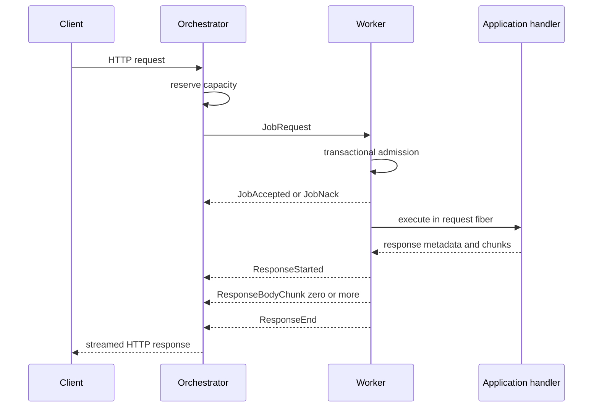

# Protocol and request lifecycle

## Public versus internal identity

Clients send normal HTTP. The orchestrator creates `requestId`, `attemptId`, an
absolute deadline, retry metadata, and an HTTP-shaped application request.
Internal tags, identities, and sequence numbers are stripped at the client
response boundary.

## Frame directions

```text
Orchestrator -> worker
  RegistrationAccepted  JobRequest  CancelJob  BeginDrain

Worker -> orchestrator
  WorkerRegistration  WorkerHealthSnapshot  JobAccepted  JobNack
  ResponseStarted  ResponseBodyChunk  ResponseEnd  ResponseFailed
  WorkerDraining
```

Effect Schema owns encoding and decoding. Untyped wire objects do not enter the
domain core.

## Framing

```text
+----------------------+---------------------------+
| payload length: u32  | UTF-8 schema JSON payload |
+----------------------+---------------------------+
```

The decoder supports one frame split over many reads and many frames coalesced
into one read. It retains only an incomplete tail and rejects empty or oversized
frames. Channel composes that pure transition with the live socket.

## Request sequence



The schema proves individual frame shape. The control plane enforces lifecycle
order and correlation.

## Failure and retry boundary

`ResponseFailed` distinguishes handler failure, deadline expiry, and
cancellation. `JobNack` reports rejection before useful execution.

The protocol carries `RetrySafe | NonRetryable` plus a distinct `attemptId`, but
automatic live rerouting after a nack is not yet wired. Current modes surface a
dispatch failure rather than silently replaying application code.
