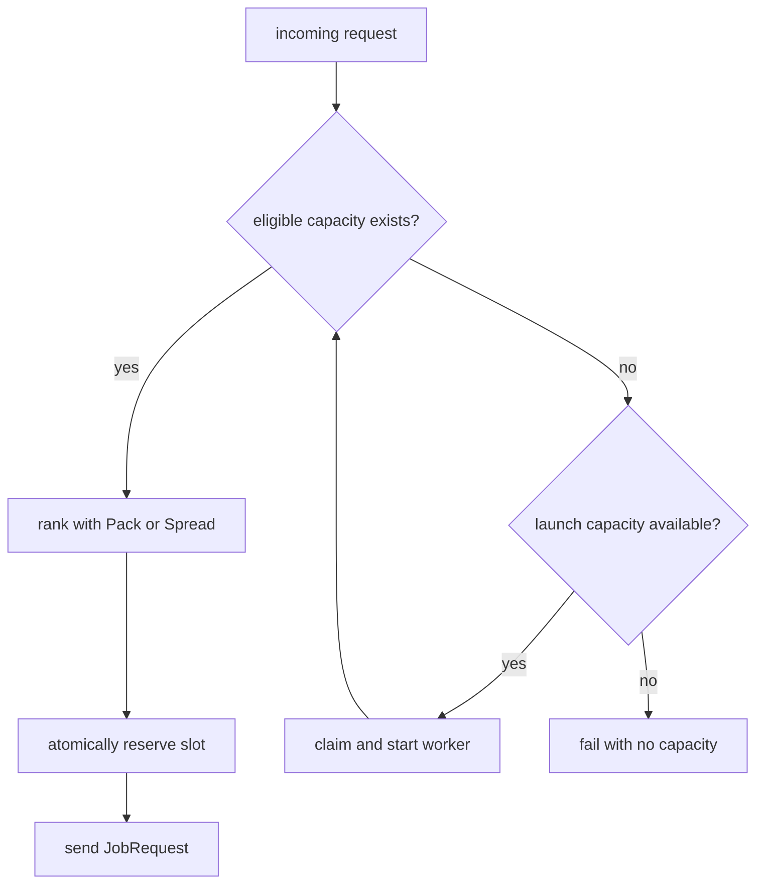

# Routing, admission, and scaling

## Fleet state

The orchestrator maintains a transactional map of connected workers. Each row
contains identity, latest health, learned admission limit, eligibility,
orchestrator-owned assignments, and peak effective load.

```text
effective load
  = snapshot inFlight
  + reservations not represented by that snapshot
  + accepted jobs newer than that snapshot
```

The worker owns authoritative admission. The orchestrator owns a recent estimate
plus its newer reservations.

## Atomic selection

Each request fiber selects and reserves in one STM transaction. Parallel fibers
cannot all observe and claim the same last slot.



## Pack and Spread

| Mode   | Ranking                                 | Goal                                      |
| ------ | --------------------------------------- | ----------------------------------------- |
| Pack   | smallest positive headroom              | fill useful workers and leave others idle |
| Spread | lowest `effectiveLoad / admissionLimit` | distribute high-throughput load           |

The local adaptive controller uses separate high and low thresholds so traffic
does not oscillate rapidly between modes.

## Nack suppression

A capacity nack is fresher than the previous snapshot. The worker becomes
ineligible until a newer healthy snapshot arrives, and its learned limit is
halved once for that snapshot generation. An internal nack removes the worker
because its capacity evidence is untrustworthy.

## Implemented by mode

Mode 1 derives desired local workers from active requests, claims launches
atomically, applies Pack/Spread hysteresis, and caps the demo fleet at four.

Mode 2 knows the finite batch size, launches `ceil(requests / 8)` up to four,
waits for registration, then routes with Spread. It does not yet connect the
adaptive controller to live AWS launches.

Periodic AWS health sampling, warm-fleet scale-down, automatic nack rerouting,
and deadline-aware replacement remain incomplete.
